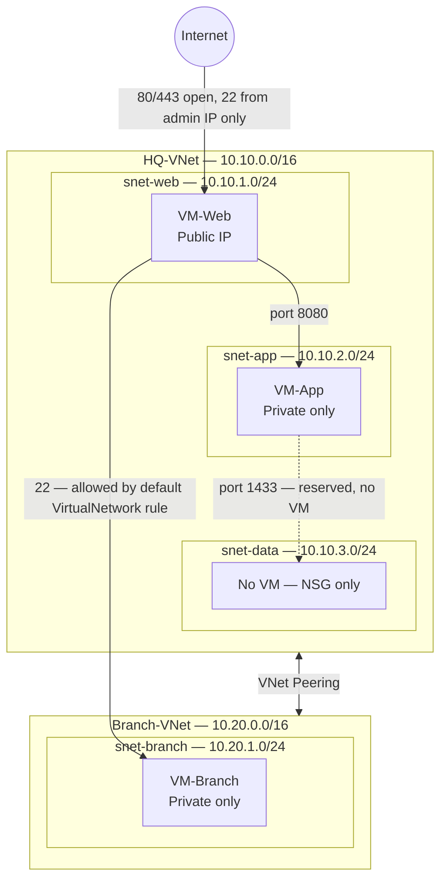

1. **Overview** — *The company, Contoso Retail, needs to connect two of their locations using Azure. Their head office `(HQ-VNet)` and their branch office `(Branch-VNet)` will be securely connected through `VNet peering`.*
2. **Architecture** 

3. **Design decisions** — *Each tier is isolated using `Network Security Groups` following least-privilege principles. A resource can only talk to what it explicitly needs to.*
4. **Build steps** — *Created a resource group `(rg-cloudnet-lab)` to contain **all resources** for clean deprovisioning. Created both VNets and necessary subnets. Created NSGs and attached them to networks and subnets. Created three VMs, and peered the networks together. Confirmed successful connectivity.*
5. **Testing and results** — *Tested: web tier is reachable from the internet, app tier is reachable only from the web subnet, and peering routes traffic and the default NSG rules allow it. Results are in Documentation folder.*
6. **Challenges and troubleshooting** — *The free account subscription was blocking VM creation due to spending limit protection. I upgraded to pay-as-you-go, but the default East US region did not offer any available VM sizes. I selected West US region, and could proceed with VM creation without further issue.*
7. **Cleanup** — *Resource group `rg-cloudnet-lab` and all resources contained within are now deleted.*