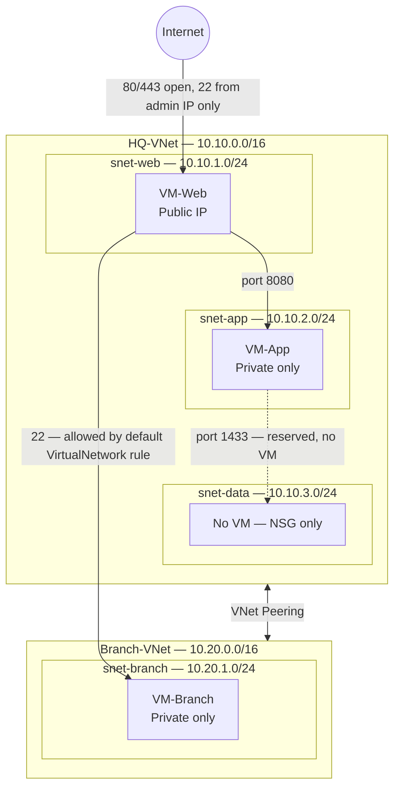

# Azure Cloud Networking Lab: Segmented Two-Site Network with VNet Peering

## Scenario

A fictional company, **Contoso Retail**, has two locations that need to be connected in Azure:

- **HQ-VNet** — head office network with a tiered application design (web, app, data)
- **Branch-VNet** — a branch office network

The two networks are connected using **VNet Peering**. Each tier is isolated using **Network Security Groups (NSGs)** following least-privilege principles: a resource can only talk to what it explicitly needs to.

This lab proves two core Azure networking concepts:
1. Subnetting and NSGs can enforce tiered network segmentation.
2. VNet Peering only provides routing between networks — it does **not** bypass NSGs. Access is still evaluated by the NSG's built-in and custom rules.

## Skills Demonstrated

- VNet and subnet design with CIDR addressing
- Network Security Groups (NSG) and least-privilege rule design
- VNet Peering (bidirectional)
- Azure CLI and Azure Portal proficiency
- Linux VM administration and basic network troubleshooting (SSH, netcat)
- Resource group-based lifecycle management (deploy and tear down cleanly)

## Architecture



## Design Decisions Already Made

These were chosen to keep the lab simple and low-cost. Change them if you have a reason to:

- **OS**: Ubuntu 24.04 LTS on all VMs (broadly available, minimal setup)
- **VM size**: Standard_D2ls_v6 (2 vCPU, 4 GB RAM, general purpose) — **not** free-tier eligible, see the Troubleshooting section below for why
- **CLI environment**: Azure Cloud Shell (Bash) — runs in the Portal, no local install
- **Region**: `westus` used in all commands below — East US is referenced in the Troubleshooting section because that's where the original quota block happened; replace `westus` with whatever region your own subscription shows quota for

## IP Address Plan

| VNet | Address Space | Subnet | Subnet Range | Resource |
|---|---|---|---|---|
| HQ-VNet | 10.10.0.0/16 | snet-web | 10.10.1.0/24 | VM-Web (public IP) |
| HQ-VNet | 10.10.0.0/16 | snet-app | 10.10.2.0/24 | VM-App (private only) |
| HQ-VNet | 10.10.0.0/16 | snet-data | 10.10.3.0/24 | None — NSG only |
| Branch-VNet | 10.20.0.0/16 | snet-branch | 10.20.1.0/24 | VM-Branch (private only) |

## Prerequisites

1. An active Azure free account (already have this).
2. Open Azure Cloud Shell in the Portal (top toolbar icon), select **Bash**.
3. Generate one SSH key pair to use for every VM in this lab. Run this in Cloud Shell:

```bash
ssh-keygen -t rsa -b 4096 -f ~/.ssh/cloudnetlab -N ""
cat ~/.ssh/cloudnetlab.pub
```

Keep this Cloud Shell session open — you will paste the public key output above into the Portal VM creation wizard later, and use the same key file for every `az vm create` command.

4. Find your public IP address. Run this in Cloud Shell:

```bash
MYIP=$(curl -s ifconfig.me)
echo $MYIP
```

Save this value — you will use it in NSG rules so only your own connection can SSH into any VM.

## Troubleshooting: Free/Pay-As-You-Go Quota and Capacity

On a genuinely new Azure subscription, VM creation can be blocked entirely, regardless of size or image. This is common enough to document as its own step, not an edge case.

**What happens:**

1. On the Azure free account, the Portal blocks VM creation outright and demands an upgrade to Pay-As-You-Go. This isn't about the OS image — the free account's spending-limit protection won't provision anything it can't guarantee stays at $0.
2. Upgrading to Pay-As-You-Go removes that block, but a second, separate blocker can appear: every VM size shows as unavailable in the size picker. This is a regional vCPU quota or capacity restriction.

**How to diagnose it:**

1. Go to **Quotas** > **Compute** in the Portal, filtered to your subscription and region.
2. Find the specific VM family you're trying to use (e.g. `Standard BS Family vCPUs`). If the limit is genuinely `0`, that family is blocked for you in that region.
3. Click **Get recommendations** next to the blocked family — Azure suggests alternative families that already have quota on your subscription.

**Don't take the first recommendation without checking it:**

Azure's suggestions aren't filtered for cost or fit. In East US, the only family with real quota was an M-series memory-optimized family built for multi-terabyte in-memory databases — wildly oversized for this lab. The rest had `0` quota too.

Change the **Region preference** dropdown on that same screen to check other regions. West US returned several small D-series v6 families with real quota (`0 of 10`), including `Standard Dlsv6 Family vCPUs`.

**Resolution used in this guide:**

- Region moved from `eastus` to `westus`.
- VM size moved from `Standard_B1s` to **`Standard_D2ls_v6`** — the smallest size in the Dlsv6 family (2 vCPU, 4 GB RAM). It won't appear on the Quotas page itself, only the family name does — search `D2ls` in the VM size picker to find it.

This sequence — free-account block, quota page, filtering out a bad recommendation, region pivot — is genuinely good "Challenges and troubleshooting" content for your README. It demonstrates real operational troubleshooting, not just following steps.

## Step 1 — Create the Resource Group (CLI)

Using one resource group for the whole lab makes cleanup a single command later.

```bash
RG="rg-cloudnet-lab"
LOCATION="westus"

az group create --name $RG --location $LOCATION
```

## Step 2 — Create HQ-VNet and Subnets (Portal)

1. Go to **Virtual networks** > **Create**.
2. Resource group: `rg-cloudnet-lab`. Name: `HQ-VNet`. Region: same as your resource group.
3. In **IP Addresses**, set the address space to `10.10.0.0/16`.
4. Delete the default subnet. Add three subnets:
   - `snet-web` — `10.10.1.0/24`
   - `snet-app` — `10.10.2.0/24`
   - `snet-data` — `10.10.3.0/24`
5. Leave NSG selection as **None** on each subnet — NSGs are created and attached separately in Step 6.
6. Review and create.

Use these exact names (`HQ-VNet`, `snet-web`, `snet-app`, `snet-data`) — the CLI commands below reference them directly.

*Screenshot of HQ-VNet address space and subnet list*

## Step 3 — Create Branch-VNet and Subnet (CLI)

```bash
az network vnet create \
  --resource-group $RG \
  --name Branch-VNet \
  --address-prefix 10.20.0.0/16 \
  --subnet-name snet-branch \
  --subnet-prefix 10.20.1.0/24
```

## Step 4 — Create the Network Security Groups (CLI)

```bash
az network nsg create --resource-group $RG --name NSG-Web --location $LOCATION
az network nsg create --resource-group $RG --name NSG-App --location $LOCATION
az network nsg create --resource-group $RG --name NSG-Data --location $LOCATION
az network nsg create --resource-group $RG --name NSG-Branch --location $LOCATION
```

## Step 5 — Add NSG Rules (CLI)

Azure NSGs include built-in inbound rules. `AllowVNetInBound` at priority 65000 allows traffic from the `VirtualNetwork` service tag, which includes peered VNets. `DenyAllInBound` at priority 65500 blocks other inbound traffic that has not been explicitly allowed. Add custom **allow** rules for required traffic and custom **deny** rules when you need to override the built-in virtual-network allowance.

**NSG-Web** — allow web traffic from anywhere, SSH only from your IP:

```bash
az network nsg rule create --resource-group $RG --nsg-name NSG-Web --name Allow-HTTP \
  --priority 100 --direction Inbound --access Allow --protocol Tcp --destination-port-ranges 80

az network nsg rule create --resource-group $RG --nsg-name NSG-Web --name Allow-HTTPS \
  --priority 110 --direction Inbound --access Allow --protocol Tcp --destination-port-ranges 443

az network nsg rule create --resource-group $RG --nsg-name NSG-Web --name Allow-SSH-Admin \
  --priority 120 --direction Inbound --access Allow --protocol Tcp --destination-port-ranges 22 \
  --source-address-prefixes $MYIP/32
```

**NSG-App** — allow the app port only from the web subnet, plus admin SSH:

```bash
az network nsg rule create --resource-group $RG --nsg-name NSG-App --name Allow-App-From-Web \
  --priority 100 --direction Inbound --access Allow --protocol Tcp --destination-port-ranges 8080 \
  --source-address-prefixes 10.10.1.0/24

az network nsg rule create --resource-group $RG --nsg-name NSG-App --name Allow-SSH-Admin \
  --priority 110 --direction Inbound --access Allow --protocol Tcp --destination-port-ranges 22 \
  --source-address-prefixes $MYIP/32
```

**NSG-Data** — reserved for a future database tier, allowed only from the app subnet (no VM will sit here, this demonstrates forward-looking least-privilege design):

```bash
az network nsg rule create --resource-group $RG --nsg-name NSG-Data --name Allow-DB-From-App \
  --priority 100 --direction Inbound --access Allow --protocol Tcp --destination-port-ranges 1433 \
  --source-address-prefixes 10.10.2.0/24
```

**NSG-Branch** — admin SSH is explicitly allowed from your public IP. Traffic from HQ-VNet is also allowed by the built-in `AllowVNetInBound` rule because HQ-VNet is peered with Branch-VNet; no custom HQ rule is required for this lab.

```bash
az network nsg rule create --resource-group $RG --nsg-name NSG-Branch --name Allow-SSH-Admin \
  --priority 100 --direction Inbound --access Allow --protocol Tcp --destination-port-ranges 22 \
  --source-address-prefixes $MYIP/32
```

*Screenshot of NSG rule list for `NSG-Web` and `NSG-App`*

## Step 6 — Attach NSGs to Subnets (Portal)

1. Go to **Virtual networks** > `HQ-VNet` > **Subnets**.
2. Click `snet-web` > set **Network security group** to `NSG-Web` > Save.
3. Click `snet-app` > set **Network security group** to `NSG-App` > Save.
4. Click `snet-data` > set **Network security group** to `NSG-Data` > Save.
5. Go to `Branch-VNet` > **Subnets** > `snet-branch` > set **Network security group** to `NSG-Branch` > Save.

## Step 7 — Deploy the VMs

**VM-Web (Portal)** — this one gets a public IP:

1. Go to **Virtual machines** > **Create** > **Azure virtual machine**.
2. Resource group: `rg-cloudnet-lab`. Name: `VM-Web`. Region: same as before.
3. Image: `Ubuntu Server 24.04 LTS`. Size: `Standard_D2ls_v6` — search `D2ls` in the size picker if it isn't in the default list.
*Screenshots of Quotas page showing the blocked VM family and the working alternative*
4. Authentication type: **SSH public key**. Paste the public key you generated in Prerequisites (output of `cat ~/.ssh/cloudnetlab.pub`).
5. In **Networking**: Virtual network `HQ-VNet`, subnet `snet-web`. Public IP: create new (default). Set **NIC network security group** to **None** — do not let the wizard create its own NSG, since `snet-web` already has `NSG-Web` attached.
6. Set **Public inbound ports** to **None** — access is already controlled by `NSG-Web` at the subnet level.
7. Review and create.

**VM-App (CLI)** — no public IP, no NIC-level NSG:

```bash
az vm create \
  --resource-group $RG \
  --name VM-App \
  --image Ubuntu2404 \
  --size Standard_D2ls_v6 \
  --vnet-name HQ-VNet \
  --subnet snet-app \
  --public-ip-address "" \
  --nsg "" \
  --admin-username azureuser \
  --ssh-key-values ~/.ssh/cloudnetlab.pub
```

**VM-Branch (CLI)** — no public IP, no NIC-level NSG:

```bash
az vm create \
  --resource-group $RG \
  --name VM-Branch \
  --image Ubuntu2404 \
  --size Standard_D2ls_v6 \
  --vnet-name Branch-VNet \
  --subnet snet-branch \
  --public-ip-address "" \
  --nsg "" \
  --admin-username azureuser \
  --ssh-key-values ~/.ssh/cloudnetlab.pub
```

## Step 8 — Configure VNet Peering (Portal)

Peering must be configured from both sides.

1. Go to `HQ-VNet` > **Peerings** > **Add**.
2. This virtual network's peering link name: `HQ-to-Branch`.
3. Remote virtual network peering link name: `Branch-to-HQ`.
4. Remote virtual network: select `Branch-VNet`.
5. Leave all other settings at default. Click **Add**.
6. Confirm the peering status shows **Connected** on both `HQ-VNet` and `Branch-VNet` peering pages.

*Screenshot of peering status showing **Connected** on both sides*

## Step 9 — Test and Prove the Design

Get VM-Web's public IP from the Portal (VM-Web > Overview) before starting.

**Test 1 — Web tier is reachable from the internet:**

```bash
ssh -i ~/.ssh/cloudnetlab azureuser@<VM-Web-Public-IP>
sudo apt update && sudo apt install -y nginx
```

Open `http://<VM-Web-Public-IP>` in a browser. Expected: the default nginx page loads.

*Screenshot of terminal output: nginx page loading in a browser*

**Test 2 — App tier is reachable only from the web subnet:**

On VM-App (SSH into it from VM-Web, since it has no public IP):

```bash
# From your machine, copy the private key to VM-Web first:
scp -i ~/.ssh/cloudnetlab ~/.ssh/cloudnetlab azureuser@<VM-Web-Public-IP>:~/.ssh/

# From inside VM-Web:
chmod 600 ~/.ssh/cloudnetlab
ssh -i ~/.ssh/cloudnetlab azureuser@<VM-App-Private-IP>
```

This copies your private key onto VM-Web to allow hopping to VM-App. Do not do this in production — use Azure Bastion or SSH agent forwarding instead. It is done here only to keep the lab simple.

On VM-App, start a listener on port 8080:

```bash
sudo apt update && sudo apt install -y netcat-openbsd
nc -lk 8080
```

From VM-Web, in a separate SSH session, test reachability:

```bash
nc -zv <VM-App-Private-IP> 8080
```

Expected: connection succeeds. This proves the web subnet can reach the app subnet on the intended port only.

*Screenshot of terminal output: `nc -zv` succeeding, VM-App test*

**Test 3 — Peering routes traffic and the default NSG rules allow it:**

From VM-Web, reach VM-Branch over its private IP. No custom HQ-specific rule is required on `NSG-Branch`:

```bash
ssh -i ~/.ssh/cloudnetlab azureuser@<VM-Branch-Private-IP>
```

Expected: the SSH connection succeeds. VNet peering provides the route, and the built-in `AllowVNetInBound` rule allows traffic from the peered HQ-VNet through `NSG-Branch`.

*Screenshot of terminal output: successful SSH connection to VM-Branch*

This demonstrates that peering supplies routing while the default NSG rules still govern access. The built-in virtual-network allowance is why the connection succeeds without a custom HQ rule.

## Documentation Guidance for Your GitHub README

Since your repo is documentation-based, structure the README around what you built and why, not just what commands you ran. Screenshots to capture at each stage:

- HQ-VNet address space and subnet list (Step 2)
- NSG rule list for `NSG-Web` and `NSG-App` (Step 5)
- Peering status showing **Connected** on both sides (Step 8)
- Terminal output: nginx page loading in a browser (Test 1)
- Terminal output: `nc -zv` succeeding, VM-App test (Test 2)
- Terminal output: successful SSH connection from VM-Web to VM-Branch over the peered VNets (Test 3)
- Quotas page showing the blocked VM family and the working alternative (see Troubleshooting section) — pairs with item 6 below

Sections to write:
1. **Overview** — the Contoso Retail scenario in your own words.
2. **Architecture** — embed the Mermaid diagram above (GitHub renders it natively).
3. **Design decisions** — why each subnet, why each NSG rule, tied to least-privilege principles.
4. **Build steps** — summarized, linking to your screenshots.
5. **Testing and results** — the three tests above, with screenshots.
6. **Challenges and troubleshooting** — the free-account/quota block documented in this guide is strong material here: what error you hit, how you diagnosed it via the Quotas page, and why you rejected the first recommended fix.
7. **Cleanup** — confirm resources were deleted to avoid ongoing charges.

## Cleanup

**Deallocate VMs** when not actively working (stops compute billing, keeps the resources):

```bash
az vm deallocate --resource-group $RG --name VM-Web
az vm deallocate --resource-group $RG --name VM-App
az vm deallocate --resource-group $RG --name VM-Branch
```

**Delete everything** when finished with the lab:

```bash
az group delete --name $RG --yes --no-wait
```

This removes every resource in one command because everything was built inside a single resource group.
